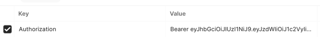

## OAuth Study With Spring

### 목차
1. OAuth 란?
2. 실습
   1. 시큐리티 없는 카카오 로그인
   2. 시큐리티 흐름
   3. 카카오 로그인

### 1. OAuth 란?
OAuth("Open Authorization")는 인터넷 사용자들이 비밀번호를 제공하지 않고,
다른 웹사이트 상의 자신들의 정보에 대해 웹사이트나 애플리케이션의 접근 권한을 부여할 수 있는 공통적인 수단으로서 사용되는,
접근 위임을 위한 개방형 표준이다.  

흔히 우리가 특정 서비스를 로그인할 때, 카카오/구글/네이버 등에 가입된 자신의 계정 정보를 사용하여,
로그인 또는 회원가입을 하는 것을 쉽게 예로 들 수 있다.

#### 흐름

즉, 사용자에 대한 정보를 소지하고 있는 서비스 (인증 서버)를 통해, 해당 사용자의 정보를 받아올 수 있는 것!  
이때, 바로 AccessToken 을 전달하지 않고, 인가 코드를 전달받고 이를 통해 다시 한번 AccessToken 을 받아온다.  
이후, 해당 AccessToken 을 사용하여 인증 서버로 부터 사용자의 정보등을 조회하는 API 를 사용할 수 있게 된다.  
  
단순하게 생각하면, 기존 서비스에서 로그인 하여 토큰을 받고 API 를 사용할 때, 토큰을 헤더에 넣어 인가받는 것처럼,  
우리 서비스를 사용할 유저의 정보를 받기 위해서 인증 서버로 부터 토큰을 받아와서 인증 서버의 API 를 사용하여 유저의 정보를 받아오는 것이다!  

**출처 : KaKao Developers**

### 실습 (Spring Security 를 적용하지 않은 경우)

```java
@GetMapping("/login/kakao")
    public String login(HttpServletResponse response) throws IOException {
        String url = "https://kauth.kakao.com/oauth/authorize";
        response.sendRedirect(url + "?client_id=" + kakaoKey + "&redirect_uri=http://localhost:8080/oauth/login/kakao/result" + "&response_type=code");

        return "ok";
    }
```
먼저, /login/kakao 페이지에 접근하면, KaKao Developers 에서 정의한 API 스펙에 맞는 URL 로 redirect 시킨다.  
이후 해당 페이지에서 카카오 로그인을 시도한다.

카카오 로그인을 성공했다면, 인카 코드를 쿼리스트링으로 포함한 redirect url 로 다시 redirect 된다. (내가 카카오에 등록한 redirect URL)  
* 여기서는 http://localhost:8080/oauth/login/kakao/result

이후 아래와 같이 해당 URL 을 처리할 수 있는 컨트롤러 메서드를 선언한다.
```java
@GetMapping("/login/kakao/result")
    public void handleCode(@RequestParam(name = "code") String authorizationCode) {
    System.out.println(authorizationCode);
}
```
이렇게 받은 code 를 사용한 API 요청을 통해 Access Token 을 발급받는다.

```java
        String url = "https://kauth.kakao.com/oauth/token";
        String grant_type = "authorization_code";
        String client_id = kakaoKey;
        String redirect_uri = "http://localhost:8080/oauth/login/kakao/result";
        String code = authorizationCode;

        MultiValueMap<String, String> parameters = new LinkedMultiValueMap<>();

        parameters.add("client_id", client_id);
        parameters.add("client_secret", kakaoKey);
        parameters.add("redirect_uri", redirect_uri);
        parameters.add("code", code);
        parameters.add("grant_type", grant_type);

        RestClient restClient = RestClient.create();
        ResponseEntity<KaKaoToken> response  = restClient.post()
                .uri(url)
                .contentType(MediaType.APPLICATION_FORM_URLENCODED)
                .body(parameters)
                .retrieve()
                .toEntity(KaKaoToken.class);

        KaKaoToken token = response.getBody();
        System.out.println(token.getAccess_token());
```

해당 Body 와 Header 는 카카오 문서에 나온대로 넣어준다!
이렇게 발급받은 토큰을 사용하여 이제 카카오 API 를 이용할 수 있게 되는 것이다.  
* 나는 로그인을 위함이니 유저의 정보를 조회할 수 있는 API 를 사용

```java
        ResponseEntity<KaKaoUserDto> kakao = restClient.get()
                .uri("https://kapi.kakao.com/v2/user/me")
                .header("Authorization", "Bearer " + token.getAccess_token())
                .retrieve()
                .toEntity(KaKaoUserDto.class);

        KaKaoUserDto test = kakao.getBody();
        System.out.println(test.getKaKaoAccount().getProfile().getNickname());
        System.out.println(test.getKaKaoAccount().getEmail());
```
현재는 하나의 컨트롤러 메서드에서 모든 요청을 처리하고 있다. 이러한 이메일을 사용하여 레포지토리를 조회하고 JWT 를 발급하거나, 회원가입 페이지로 redirect 하면 로그인 완성!    
이를 효율적으로 개선하기 위해 Service 계층을 만들어서 분리하거나 하여 책임을 분리할 수 있을 것 같다!  
  


### 2. 실습

#### 시큐리티란?

`Spring Security is a framework that focuses on providing both authentication and authorization to Java applications`  

스프링 시큐리티 공식 문서에 나와있는 소개글이다. 이 글에 따르면, 스프링 시큐리티는 인증 및 인가 기능을 제공해주는 프레임워크이다  
공식문서에 따라 스프링 시큐리티의 대략적인 구조를 알아보고 실습을 진행해보자!

* `SecurityContextHolder` - The SecurityContextHolder is where Spring Security stores the details of who is authenticated.
  * 인증된 사용자의 정보를 저장하는 스토어


* `SecurityContext` - is obtained from the SecurityContextHolder and contains the Authentication of the currently authenticated user.
  * SecurityContextHolder 에 포함되며, 이는 현재 인증된 유저의 정보를 포함한다.


* `Authentication` - Can be the input to AuthenticationManager to provide the credentials a user has provided to authenticate or the current user from the SecurityContext
   * 사용자가 인증을 위해 제공한 자격 증명을 제공하기 위한 AuthenticationManager 의 입력이 된다. Authentication 은 다음을 포함한다.

  * `principal`: Identifies the user. When authenticating with a username/password this is often an instance of UserDetails.

  * `credentials`: Often a password. In many cases, this is cleared after the user is authenticated, to ensure that it is not leaked.

  * `authorities`: The GrantedAuthority instances are high-level permissions the user is granted. Two examples are roles and scopes.


* `AuthenticationManager` - the API that defines how Spring Security’s Filters perform authentication
  * 시큐리티 필터가 인증을 수행하는 방법을 정의한 API.


1. SecurityFilterChain 을 통해, Authentication 객체를 만든다.
2. Authentication 은 AuthenticationManager 에게 전달되어, 해당 Authentication 객체가 인증이 되었는지 확인한다.
3. 성공 / 실패에 따라 분기처리 된다.
4. 성공시, SecurityContextHolder 에 해당 요청에 대한 인증 정보가 저장된다.

대략 이런 흐름인 것 같다.! 아직 크게 감이 잡히지 않지만 실습을 진행하면서 한번 더 정의를 구체화 해봐야겠다.

참고 주소 : https://docs.spring.io/spring-security/reference/servlet/authentication/architecture.html#servlet-authentication-securitycontext

#### 실습1 : Security With JWT

**SecurityConfig**
```java
@Configuration
@EnableWebSecurity
public class SecurityConfig {
    
    @Bean
    public WebSecurityCustomizer webSecurityCustomizer() { // security를 적용하지 않을 리소스
        return web -> web.ignoring()
                .requestMatchers("/error", "/favicon.ico");
    }

    @Bean
    public SecurityFilterChain securityFilterChain(HttpSecurity http, JwtFilter jwtFilter) throws Exception {
        http
                .formLogin(AbstractHttpConfigurer::disable)
                .httpBasic(AbstractHttpConfigurer::disable)
                .csrf(AbstractHttpConfigurer::disable)

                .authorizeHttpRequests((authorize) -> {
                    authorize.requestMatchers("/api/login").permitAll();
                    authorize.anyRequest().authenticated();
                })

                .sessionManagement((session) -> {
                    session.sessionCreationPolicy(SessionCreationPolicy.STATELESS);
                })

                .addFilterBefore(jwtFilter, UsernamePasswordAuthenticationFilter.class);

        return http.build();
    }

    @Bean
    public UserDetailsService userDetailsService() {
        UserDetails userDetails = User.withDefaultPasswordEncoder()
                .username("user")
                .password("password")
                .roles("USER")
                .build();

        return new InMemoryUserDetailsManager(userDetails);
    }

    @Bean
    public JwtFilter jwtFilter(JwtService jwtService, UserDetailsService userDetailsService) {
        return new JwtFilter(jwtService, userDetailsService);
    }
}
```
1. `jwtFilter`  
Security Filter 를 커스텀하여 Request Header 에 포함된 토큰을 기반으로 검증(인증)을 시도한다. 
이를 위해 구현한 JwtFilter 를 빈으로 등록하고 FilterChain 에 추가한다.

2. `userDetailService()`  
현재는 DB 를 사용하지 않으므로, `임의의 UserDetails (name : username, pw : password, role : USER) 객체`를 생성하여 메모리에 등록하고 
이를 관리하는 Service (InMemoryUserDetailsManager)를 반환한다.

3. `securityFilterChain`
먼저, 토큰을 사용할 것이므로 기본 제공하는 폼로그인이 필요 없으므로 `formLogin` 을 비활성화한다. 이후 `httpBasic` 을 비활성화 한다.
이 httpBasic 인증 요청은 요청 헤더에 사용자의 ID, PW 를 인코딩하여 함께 보내는 방식이라고 한다.
이후, 로그인을 위한 API 만 인증에 대해 허가하고, 나머지 요청에 대해서는 인증을 요구하도록 설정한다.

**JwtService**
```java
@Service
@Slf4j
public class JwtService {
    private static final String secretKey = "secret-key";

    public String createToken(String username) {

        try {
            return Jwts.builder()
                    .setSubject("user")
                    .claim("username", username)
                    .setExpiration(new Date(System.currentTimeMillis() + 1000 * 60 * 60 * 24))
                    .signWith(SignatureAlgorithm.HS256, secretKey.getBytes())
                    .compact();
        } catch (Exception e) {
            return "";
        }
    }

    public String parse(String token) {
        Claims claims = Jwts.parser()
                .setSigningKey(secretKey.getBytes())
                .parseClaimsJws(token)
                .getBody();

        return claims.get("username", String.class);
    }
}
```
1. `CreateToken(String username)`
주어진 username 정보를 담고 있는 토큰을 생성한다.
2. `parse(String token)`
Token 으로부터 username 을 꺼낸다.

**JwtController**
```java
@RestController
public class JwtController {

    private final JwtService jwtService;

    public JwtController(JwtService jwtService) {
        this.jwtService = jwtService;
    }


    @GetMapping("/api/login")
    public String login() {
       String token = jwtService.createToken("user");
       return token;
    }
}
```
실제라면, Request 로부터 ID, PW 를 받아 DB에 저장된 User 정보를 사용해서 토큰을 생성했겠지만, 지금은 미리 만들어분 UserDetails 객체의 이름인 user 를 넣어
직접 토큰을 생성한다. 이를 통해 만들어진 토큰 값을 반환한다.

**JwtFilter**
```java
@Slf4j
public class JwtFilter extends OncePerRequestFilter {

    private final JwtService jwtService;
    private final UserDetailsService userDetailsService;

    public JwtFilter(JwtService jwtService, UserDetailsService userDetailsService) {
        this.jwtService = jwtService;
        this.userDetailsService = userDetailsService;
    }

    @Override
    protected void doFilterInternal(HttpServletRequest request, HttpServletResponse response, FilterChain filterChain) throws ServletException, IOException {
        try {
            String token = request.getHeader("Authorization").startsWith("Bearer ") ? request.getHeader("Authorization").substring(7) : null;
            String username = jwtService.parse(token);

            UserDetails userDetails = userDetailsService.loadUserByUsername(username);
            Authentication authentication = new UsernamePasswordAuthenticationToken(userDetails, null, userDetails.getAuthorities());
            userDetails.getAuthorities().stream().iterator().forEachRemaining(e -> log.info(e.getAuthority()));

            SecurityContextHolder.getContext().setAuthentication(authentication);

            filterChain.doFilter(request, response);
        } catch (Exception e) {
            e.printStackTrace();
            log.error(e.getMessage());
            log.error("Error Catch");

            filterChain.doFilter(request, response);
        }
    }
}
```

1. 위의 사진과 같이 헤더에 값이 주어지면 토큰 값을 꺼내어, username 을 얻는다.
2. 이를 통해 userDetailsService 로부터 이 username 과 일치하는 `userDetails` 객체를 찾는다.
3. 이후, 해당 userDetails 를 갖는 `Authentication` 객체를 생성하여 `ContextHolder` 에 저장한다.
4. 다음 필터로 이동한다.

이렇게 Spring Security 를 사용해서 Jwt 로그인을 구현해봤다! 이를 좀 더 보완해서 에러 처리를 하고, DB 까지 사용하는 방식으로 변경해보겠다.

#### 실습2 : Security With JWT + DB

**User Entity**  
```java
@Entity
@Getter
public class User  {
    @Id
    @GeneratedValue(strategy = GenerationType.IDENTITY)
    private Long id;

    @Column
    private String email;

    @Column
    private String password;

    @Column
    private String role;

    public User() {}

    public User(String email, String password,String role) {
        this.email = email;
        this.password = password;
        this.role = role;
    }
}
```
먼저, 실제 사용자의 정보를 저장할 User Entity 를 작성하였다.   
따라서 로그인 시, DB에 접근하여 해당 User 가 존재하는지 확인 후, User 가 존재한다면, JWT Token 을 발급하게 되는 것이다.

```java
@Service
public class JwtService2 {
    private static final String secretKey = "secret-key";

    public String createToken(String userId, String role) {
        return Jwts.builder()
                .claim("username", userId)
                .claim("role", role)
                .setIssuedAt(new Date())
                .setExpiration(new Date(System.currentTimeMillis() + 1000 * 60 * 60 * 24))
                .signWith(SignatureAlgorithm.HS256, secretKey.getBytes())
                .compact();
    }

    public Claims getClaim(String token) {
        return Jwts.parser().setSigningKey(secretKey.getBytes()).parseClaimsJws(token).getBody();
    }

}
```

토큰에는 UserID 와 Role 을 담는다. (유효성에 대해서는 체크하지 않음 !)

```java
@Override
protected void doFilterInternal(HttpServletRequest request, HttpServletResponse response, FilterChain filterChain) throws ServletException, IOException {
    log.info("URI : {}", request.getRequestURI());
    if (list.contains(request.getRequestURI())) {
        filterChain.doFilter(request, response);
        return;
    }

    String token = request.getHeader("Authorization").startsWith("Bearer ") ? request.getHeader("Authorization").substring(7) : null;
    log.info("token: {}", token);
    log.info("User ID : {}", jwtService2.getClaim(token).get("username").toString());
    log.info("User Role : {}", jwtService2.getClaim(token).get("role").toString());

    if (token != null && SecurityContextHolder.getContext().getAuthentication() == null) {
        UserDetails userDetails= customUserDetailsService.loadUserByUsername(jwtService2.getClaim(token).get("username").toString());
        log.info("userDetails Name : {} ", userDetails.getUsername());
        log.info("userDetails Role : {} ", userDetails.getAuthorities());
        UsernamePasswordAuthenticationToken authentication = new UsernamePasswordAuthenticationToken(userDetails, null, userDetails.getAuthorities());
        SecurityContextHolder.getContext().setAuthentication(authentication);
    }

    filterChain.doFilter(request, response);
}

```
위는 JWTFilter 이며, 토큰을 추출하여 해당 토큰의 username 과 role 을 얻은 후, 이를 사용하여 UserDetails 를 생성한다.
UserDetails 를 사용하여 Authentication 객체를 생성하고 이를 ContextHolder 에 저장한다.

```java
    @Override
    public UserDetails loadUserByUsername(String username) throws UsernameNotFoundException {
        Long userId = Long.parseLong(username);
        User user= userRepository.findById(userId).orElseThrow(() -> new RuntimeException());
        return new CustomUserDetails(user);
    }
```
이는 UserDetailsService 를 구현한 CustomUserDetailsService 이며, 여기서는 매 Filter 마다 DB에 접근하고 있는데,
애초에 Token 을 생성할 때, UserDetails 를 생성할 수 있다면 굳이 매 요청마다 접근할 필요는 없을 것 같다!

이렇게, DB 까지 연결하여 Security + JWT 를 구현해봤다.  
이제 이 모든걸 조합해서, Kakao Login 을 구현해보자!
---
#### 실습3

**CustomOAuth2UserService**  
스프링 시큐리티의 OAuth2 를 사용하면, 실습1에서 보여줬던 인가 코드를 받은 후, Server(KaKao)로 부터 토큰을 받아와 유저 정보를 가져오는 과정을 Security 가 대신 처리해준다.  
따라서 우리는 가져온 정보를 사용하여 유저정보를 담은 객체(OAuth2UserInfo)를 생성하고 이를 통해 JWT Token 을 발급해주기만 하면 된다.
```java
public class CustomOAuth2UserService extends DefaultOAuth2UserService {

    private final MemberRepository memberRepository;

    @Transactional
    @Override
    public OAuth2User loadUser(OAuth2UserRequest userRequest) throws OAuth2AuthenticationException {

        Map<String, Object> oAuth2UserAttributes = super.loadUser(userRequest).getAttributes();
        String registrationId = userRequest.getClientRegistration().getRegistrationId();

        String userNameAttributeName = userRequest.getClientRegistration().getProviderDetails()
                .getUserInfoEndpoint().getUserNameAttributeName();

        OAuth2UserInfo oAuth2UserInfo = OAuth2UserInfo.of(registrationId, oAuth2UserAttributes);

        Member member = getOrSave(oAuth2UserInfo);

        return new PrincipalDetails(member, oAuth2UserAttributes, userNameAttributeName);
    }

    public Member getOrSave(OAuth2UserInfo oAuth2UserInfo) {
        Member member = memberRepository.findByEmail(oAuth2UserInfo.email())
                .orElseGet(oAuth2UserInfo::toEntity);
        return memberRepository.save(member);
    }
}
```
`registrationId` 에는 제공자의 아이디가 담긴다. (kakao / googl / naver . . .) 제공자에 따라 정보를 주는 형식이 다르기 때문에,  
이를 기반으로 정보를 받아와 `OAuth2UserInfo` 를 생성한다. 이렇게 생성된 객체를 사용하여 PrincipalDetails 객체를 만들어 Return 한다.
이렇게 성공적으로 Return 이 되면, `OAuth2SuccessHandler` 가 실행된다. 

**OAuth2SuccessHandler**  
```java
@Component
@RequiredArgsConstructor
@Slf4j
public class OAuth2SuccessHandler implements AuthenticationSuccessHandler {

    private final JWTService jwtService;

    @Override
    public void onAuthenticationSuccess(HttpServletRequest request, HttpServletResponse response, Authentication authentication) throws IOException, ServletException {
        String token = jwtService.createToken(authentication);

        // 쿠키를 사용해서 토큰 전달.
        Cookie cookie = new Cookie("token", token);
        response.addCookie(cookie);

        // URL 을 사용해서 토큰 전달.
        String redirectUrl = UriComponentsBuilder.fromUriString("/auth/success")
                .queryParam("accessToken", token)
                .build().toUriString();

        response.sendRedirect(redirectUrl);
    }
}
```
현재는 프론트 페이지가 없으므로, redirectURL 에 쿼리스트링을 사용하여 토큰 값을 함께 전달하는 방식을 사용하였다.  
이렇게 전달된 토큰을 헤더에 넣으면, 권한이 필요한 URI에 대해서는 JWT Filter 를 거치며 토큰 검증하게 될 것이다.

**PrincipalDetails**
```java
public class PrincipalDetails  implements OAuth2User, UserDetails {

    private Member member;
    private Map<String, Object> attributes;
    private String attributeKey;

    public PrincipalDetails(Member member, Map<String, Object> attributes, String attributeKey) {
        this.member = member;
        this.attributes = attributes;
        this.attributeKey = attributeKey;
    }

    @Override
    public String getPassword() {
        return "";
    }

    @Override
    public String getUsername() {
        return member.getId().toString();
    }

    @Override
    public boolean isAccountNonExpired() {
        return true;
    }

    @Override
    public boolean isAccountNonLocked() {
        return true;
    }

    @Override
    public boolean isCredentialsNonExpired() {
        return true;
    }

    @Override
    public boolean isEnabled() {
        return true;
    }

    @Override
    public Map<String, Object> getAttributes() {
        return attributes;
    }

    @Override
    public Collection<? extends GrantedAuthority> getAuthorities() {
        return Collections.singletonList(
                new SimpleGrantedAuthority(member.getRole())
        );
    }
```
OAuth2UserInfo 를 기반으로 OAuth2User 객체를 생성하기 위해 커스텀한 객체이다. 이는 UserDetails 도 함께 구현하고 있으므로,  
일반 로그인 사용 시에도 이를 생성하여 Authentication 객체를 만든다면, 쉽게 사용할 수 있을 것이다.  

부족하지만, 이렇게 OAuth 를 구현하며 조금은 Security 에 대한 이해가 생긴 것 같다.