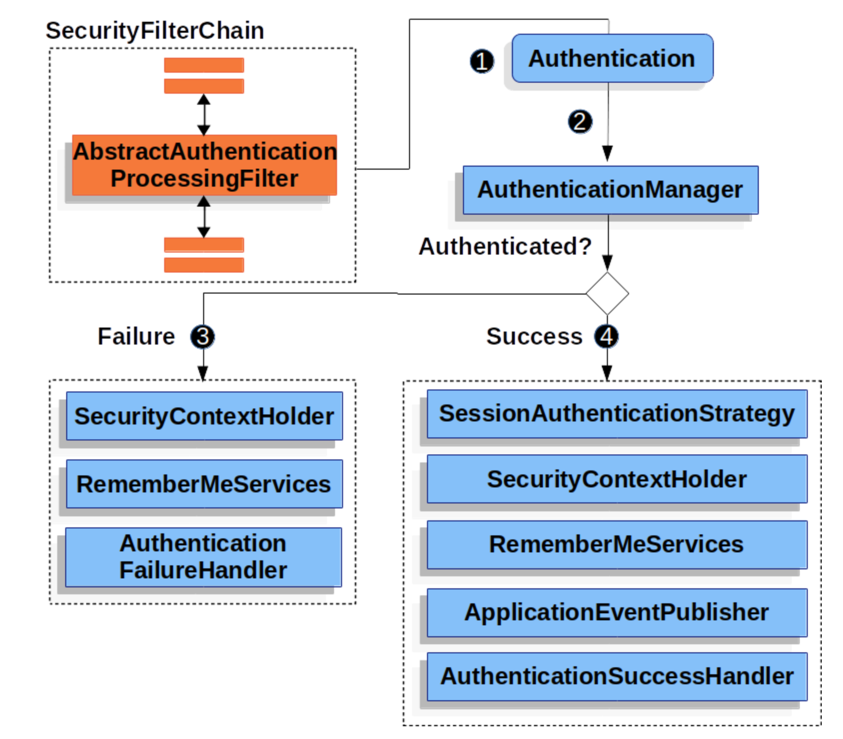

## OAuth Study With Spring

### 목차
1. OAuth 란?
2. 실습
   1. 시큐리티 없는 카카오 로그인
   2. 시큐리티 흐름
   3. 카카오 로그인

### 1. OAuth 란?
OAuth("Open Authorization")는 인터넷 사용자들이 비밀번호를 제공하지 않고,
다른 웹사이트 상의 자신들의 정보에 대해 웹사이트나 애플리케이션의 접근 권한을 부여할 수 있는 공통적인 수단으로서 사용되는,
접근 위임을 위한 개방형 표준이다.  

흔히 우리가 특정 서비스를 로그인할 때, 카카오/구글/네이버 등에 가입된 자신의 계정 정보를 사용하여,
로그인 또는 회원가입을 하는 것을 쉽게 예로 들 수 있다.

#### 흐름

즉, 사용자에 대한 정보를 소지하고 있는 서비스 (인증 서버)를 통해, 해당 사용자의 정보를 받아올 수 있는 것!  
이때, 바로 AccessToken 을 전달하지 않고, 인가 코드를 전달받고 이를 통해 다시 한번 AccessToken 을 받아온다.  
이후, 해당 AccessToken 을 사용하여 인증 서버로 부터 사용자의 정보등을 조회하는 API 를 사용할 수 있게 된다.  
  
단순하게 생각하면, 기존 서비스에서 로그인 하여 토큰을 받고 API 를 사용할 때, 토큰을 헤더에 넣어 인가받는 것처럼,  
우리 서비스를 사용할 유저의 정보를 받기 위해서 인증 서버로 부터 토큰을 받아와서 인증 서버의 API 를 사용하여 유저의 정보를 받아오는 것이다!  

**출처 : KaKao Developers**

### 실습 (Spring Security 를 적용하지 않은 경우)

```java
@GetMapping("/login/kakao")
    public String login(HttpServletResponse response) throws IOException {
        String url = "https://kauth.kakao.com/oauth/authorize";
        response.sendRedirect(url + "?client_id=" + kakaoKey + "&redirect_uri=http://localhost:8080/oauth/login/kakao/result" + "&response_type=code");

        return "ok";
    }
```
먼저, /login/kakao 페이지에 접근하면, KaKao Developers 에서 정의한 API 스펙에 맞는 URL 로 redirect 시킨다.  
이후 해당 페이지에서 카카오 로그인을 시도한다.

카카오 로그인을 성공했다면, 인카 코드를 쿼리스트링으로 포함한 redirect url 로 다시 redirect 된다. (내가 카카오에 등록한 redirect URL)  
* 여기서는 http://localhost:8080/oauth/login/kakao/result

이후 아래와 같이 해당 URL 을 처리할 수 있는 컨트롤러 메서드를 선언한다.
```java
@GetMapping("/login/kakao/result")
    public void handleCode(@RequestParam(name = "code") String authorizationCode) {
    System.out.println(authorizationCode);
}
```
이렇게 받은 code 를 사용한 API 요청을 통해 Access Token 을 발급받는다.

```java
        String url = "https://kauth.kakao.com/oauth/token";
        String grant_type = "authorization_code";
        String client_id = kakaoKey;
        String redirect_uri = "http://localhost:8080/oauth/login/kakao/result";
        String code = authorizationCode;

        MultiValueMap<String, String> parameters = new LinkedMultiValueMap<>();

        parameters.add("client_id", client_id);
        parameters.add("client_secret", kakaoKey);
        parameters.add("redirect_uri", redirect_uri);
        parameters.add("code", code);
        parameters.add("grant_type", grant_type);

        RestClient restClient = RestClient.create();
        ResponseEntity<KaKaoToken> response  = restClient.post()
                .uri(url)
                .contentType(MediaType.APPLICATION_FORM_URLENCODED)
                .body(parameters)
                .retrieve()
                .toEntity(KaKaoToken.class);

        KaKaoToken token = response.getBody();
        System.out.println(token.getAccess_token());
```

해당 Body 와 Header 는 카카오 문서에 나온대로 넣어준다!
이렇게 발급받은 토큰을 사용하여 이제 카카오 API 를 이용할 수 있게 되는 것이다.  
* 나는 로그인을 위함이니 유저의 정보를 조회할 수 있는 API 를 사용

```java
        ResponseEntity<KaKaoUserDto> kakao = restClient.get()
                .uri("https://kapi.kakao.com/v2/user/me")
                .header("Authorization", "Bearer " + token.getAccess_token())
                .retrieve()
                .toEntity(KaKaoUserDto.class);

        KaKaoUserDto test = kakao.getBody();
        System.out.println(test.getKaKaoAccount().getProfile().getNickname());
        System.out.println(test.getKaKaoAccount().getEmail());
```
현재는 하나의 컨트롤러 메서드에서 모든 요청을 처리하고 있다. 이러한 이메일을 사용하여 레포지토리를 조회하고 JWT 를 발급하거나, 회원가입 페이지로 redirect 하면 로그인 완성!    
이를 효율적으로 개선하기 위해 Service 계층을 만들어서 분리하거나 하여 책임을 분리할 수 있을 것 같다!  
  


### 2. 실습

#### 시큐리티란?

`Spring Security is a framework that focuses on providing both authentication and authorization to Java applications`  

스프링 시큐리티 공식 문서에 나와있는 소개글이다. 이 글에 따르면, 스프링 시큐리티는 인증 및 인가 기능을 제공해주는 프레임워크이다  
공식문서에 따라 스프링 시큐리티의 대략적인 구조를 알아보고 실습을 진행해보자!

* `SecurityContextHolder` - The SecurityContextHolder is where Spring Security stores the details of who is authenticated.
  * 인증된 사용자의 정보를 저장하는 스토어


* `SecurityContext` - is obtained from the SecurityContextHolder and contains the Authentication of the currently authenticated user.
  * SecurityContextHolder 에 포함되며, 이는 현재 인증된 유저의 정보를 포함한다.


* `Authentication` - Can be the input to AuthenticationManager to provide the credentials a user has provided to authenticate or the current user from the SecurityContext
   * 사용자가 인증을 위해 제공한 자격 증명을 제공하기 위한 AuthenticationManager 의 입력이 된다. Authentication 은 다음을 포함한다.

  * `principal`: Identifies the user. When authenticating with a username/password this is often an instance of UserDetails.

  * `credentials`: Often a password. In many cases, this is cleared after the user is authenticated, to ensure that it is not leaked.

  * `authorities`: The GrantedAuthority instances are high-level permissions the user is granted. Two examples are roles and scopes.


* `AuthenticationManager` - the API that defines how Spring Security’s Filters perform authentication
  * 시큐리티 필터가 인증을 수행하는 방법을 정의한 API.



1. SecurityFilterChain 을 통해, Authentication 객체를 만든다.
2. Authentication 은 AuthenticationManager 에게 전달되어, 해당 Authentication 객체가 인증이 되었는지 확인한다.
3. 성공 / 실패에 따라 분기처리 된다.
4. 성공시, SecurityContextHolder 에 해당 요청에 대한 인증 정보가 저장된다.

대략 이런 흐름인 것 같다.! 아직 크게 감이 잡히지 않지만 실습을 진행하면서 한번 더 정의를 구체화 해봐야겠다.

참고 주소 : https://docs.spring.io/spring-security/reference/servlet/authentication/architecture.html#servlet-authentication-securitycontext

#### 실습1

