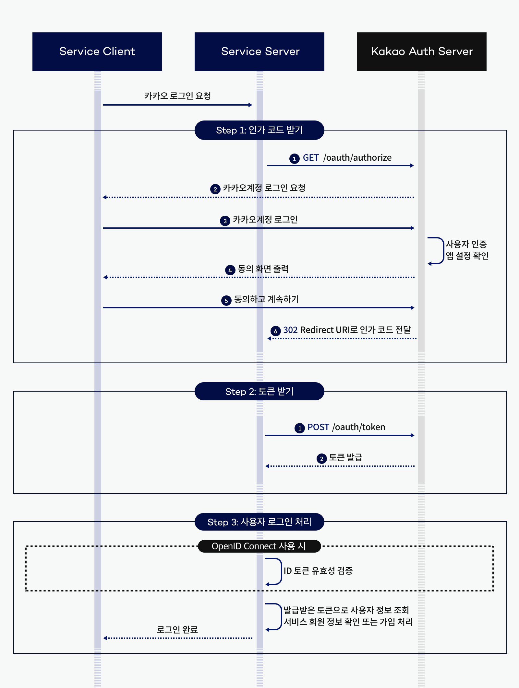

## OAuth Study With Spring

### 목차
1. OAuth 란?
2. 실습
   1. 시큐리티 없는 카카오 로그인
   2. 카카오 로그인

### OAuth 란?
OAuth("Open Authorization")는 인터넷 사용자들이 비밀번호를 제공하지 않고,
다른 웹사이트 상의 자신들의 정보에 대해 웹사이트나 애플리케이션의 접근 권한을 부여할 수 있는 공통적인 수단으로서 사용되는,
접근 위임을 위한 개방형 표준이다.  

흔히 우리가 특정 서비스를 로그인할 때, 카카오/구글/네이버 등에 가입된 자신의 계정 정보를 사용하여,
로그인 또는 회원가입을 하는 것을 쉽게 예로 들 수 있다.

#### 흐름

즉, 사용자에 대한 정보를 소지하고 있는 서비스 (인증 서버)를 통해, 해당 사용자의 정보를 받아올 수 있는 것!  
이때, 바로 AccessToken 을 전달하지 않고, 인가 코드를 전달받고 이를 통해 다시 한번 AccessToken 을 받아온다.  
이후, 해당 AccessToken 을 사용하여 인증 서버로 부터 사용자의 정보등을 조회하는 API 를 사용할 수 있게 된다.  
  
단순하게 생각하면, 기존 서비스에서 로그인 하여 토큰을 받고 API 를 사용할 때, 토큰을 헤더에 넣어 인가받는 것처럼,  
우리 서비스를 사용할 유저의 정보를 받기 위해서 인증 서버로 부터 토큰을 받아와서 인증 서버의 API 를 사용하여 유저의 정보를 받아오는 것이다!  

**출처 : KaKao Developers**

### 실습 (Spring Security 를 적용하지 않은 경우)

```java
@GetMapping("/login/kakao")
    public String login(HttpServletResponse response) throws IOException {
        String url = "https://kauth.kakao.com/oauth/authorize";
        response.sendRedirect(url + "?client_id=" + kakaoKey + "&redirect_uri=http://localhost:8080/oauth/login/kakao/result" + "&response_type=code");

        return "ok";
    }
```
먼저, /login/kakao 페이지에 접근하면, KaKao Developers 에서 정의한 API 스펙에 맞는 URL 로 redirect 시킨다.  
이후 해당 페이지에서 카카오 로그인을 시도한다.

카카오 로그인을 성공했다면, 인카 코드를 쿼리스트링으로 포함한 redirect url 로 다시 redirect 된다. (내가 카카오에 등록한 redirect URL)  
* 여기서는 http://localhost:8080/oauth/login/kakao/result

이후 아래와 같이 해당 URL 을 처리할 수 있는 컨트롤러 메서드를 선언한다.
```java
@GetMapping("/login/kakao/result")
    public void handleCode(@RequestParam(name = "code") String authorizationCode) {
    System.out.println(authorizationCode);
}
```
이렇게 받은 code 를 사용한 API 요청을 통해 Access Token 을 발급받는다.

```java
        String url = "https://kauth.kakao.com/oauth/token";
        String grant_type = "authorization_code";
        String client_id = kakaoKey;
        String redirect_uri = "http://localhost:8080/oauth/login/kakao/result";
        String code = authorizationCode;

        MultiValueMap<String, String> parameters = new LinkedMultiValueMap<>();

        parameters.add("client_id", client_id);
        parameters.add("client_secret", kakaoKey);
        parameters.add("redirect_uri", redirect_uri);
        parameters.add("code", code);
        parameters.add("grant_type", grant_type);

        RestClient restClient = RestClient.create();
        ResponseEntity<KaKaoToken> response  = restClient.post()
                .uri(url)
                .contentType(MediaType.APPLICATION_FORM_URLENCODED)
                .body(parameters)
                .retrieve()
                .toEntity(KaKaoToken.class);

        KaKaoToken token = response.getBody();
        System.out.println(token.getAccess_token());
```

해당 Body 와 Header 는 카카오 문서에 나온대로 넣어준다!
이렇게 발급받은 토큰을 사용하여 이제 카카오 API 를 이용할 수 있게 되는 것이다.  
* 나는 로그인을 위함이니 유저의 정보를 조회할 수 있는 API 를 사용

```java
        ResponseEntity<KaKaoUserDto> kakao = restClient.get()
                .uri("https://kapi.kakao.com/v2/user/me")
                .header("Authorization", "Bearer " + token.getAccess_token())
                .retrieve()
                .toEntity(KaKaoUserDto.class);

        KaKaoUserDto test = kakao.getBody();
        System.out.println(test.getKaKaoAccount().getProfile().getNickname());
        System.out.println(test.getKaKaoAccount().getEmail());
```
현재는 하나의 컨트롤러 메서드에서 모든 요청을 처리하고 있다. 이를 효율적으로 개선하기 위해  
Service 계층을 만들어서 분리하거나 하여 책임을 분리할 수 있을 것 같다!  
(이제, Spring Security 를 사용하면, 어떻게 변화되는지 확인해보도록 하자!)

